# oh-my-agent Architecture Map

> Complete visual reference of the plugin internals. Each mermaid diagram is a self-contained subsystem.

## Table of Contents

1. [Plugin Entry & Initialization](#1-plugin-entry--initialization)
2. [Agent System (15 agents)](#2-agent-system-15-agents)
3. [Hook System (5-tier, 53-63 hooks)](#3-hook-system-5-tier-53-63-hooks)
4. [Hook Event Routing](#4-hook-event-routing)
5. [Tool Catalog (31 native + 6 LSP)](#5-tool-catalog-31-native--6-lsp)
6. [Feature Modules (19)](#6-feature-modules-19)
7. [Background-Agent Lifecycle](#7-background-agent-lifecycle)
8. [Audit-Loop](#8-audit-loop)
9. [Config System](#9-config-system)
10. [MCP System (3 tiers)](#10-mcp-system-3-tiers)
11. [Model Resolution](#11-model-resolution)
12. [File Reference Tables](#12-file-reference-tables)

---

## 1. Plugin Entry & Initialization

```mermaid
flowchart TD
    A["src/index.ts:6 default export"] --> B["src/testing/create-plugin-module.ts:97"]
    B --> C["installAgentSortShim shared/agent-sort-shim"]
    C --> D["initConfigContext cli/config-manager"]
    D --> E["migrateLegacyWorkspaceDirectory shared/"]
    E --> F["detectDuplicateOmoPlugin shared/"]
    F --> G["injectServerAuthIntoClient shared/"]
    G --> H["loadPluginConfig plugin-config/layered-config-loader.ts:121"]
    H --> I["recordPluginTelemetry shared/posthog"]
    I --> J["initLiveServerRoute shared/live-server-route"]
    J --> K["selectRuntimeSecuritySkills features/opencode-runtime-skills"]
    K --> L["initI18n shared/i18n"]
    L --> M["setAgentSortOrder shared/agent-sort-shim"]
    M --> N["checkTeamModeDependencies features/team-mode/deps"]
    N --> O["createModelCacheState plugin-state.ts"]
    O --> P["createManagers create-managers.ts:42"]
    P --> Q["createTools create-tools.ts:23"]
    Q --> R["createHooks create-hooks.ts:33"]
    R --> S["createPluginInterface plugin-interface.ts:20"]
    S --> T["createPluginDispose plugin-dispose.ts:5"]
    T --> U["+session.compacting +compaction.autocontinue"]
    U --> V["Return pluginHooks to OpenCode"]
```

**Key files:**
- Entry: `src/index.ts:6` — thin wrapper, calls `createPluginModule()`
- Orchestrator: `src/testing/create-plugin-module.ts:97` — all 25 init steps
- Interface: `src/plugin-interface.ts:20` — maps 14 OpenCode hook names to handlers

---

## 2. Agent System (15 agents)

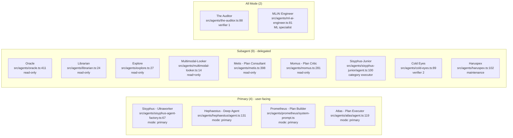

**Agent modes:**
- `primary` = user can select directly (4)
- `subagent` = only spawned via `task` tool (9)
- `all` = both primary and subagent (2)

**Model inheritance:** All agents inherit caller's model by default. No hardcoded model requirements in code. Config override via `agents.<name>.model`.

**Tool restrictions:**
| Agent | Denied Tools |
|-------|-------------|
| Oracle | write, edit, apply_patch, task |
| Librarian | write, edit, apply_patch, task, call_omo_agent |
| Explore | write, edit, apply_patch, task, call_omo_agent |
| Multimodal-Looker | ALL except read (allowlist) |
| Metis | write, edit, apply_patch |
| Momus | write, edit, apply_patch |
| The Auditor | write, edit, apply_patch, task |
| Cold Eyes | write, edit, apply_patch, task |
| Haruspex | write, edit, apply_patch |
| Sisyphus-Junior | task (+ apply_patch blocked for GPT) |
| Sisyphus | None |
| Hephaestus | call_omo_agent |
| Atlas | task, call_omo_agent |
| Prometheus | .md-only writes (hook-enforced) |
| ML/AI Engineer | None |

---

## 3. Hook System (5-tier, 53-63 hooks)

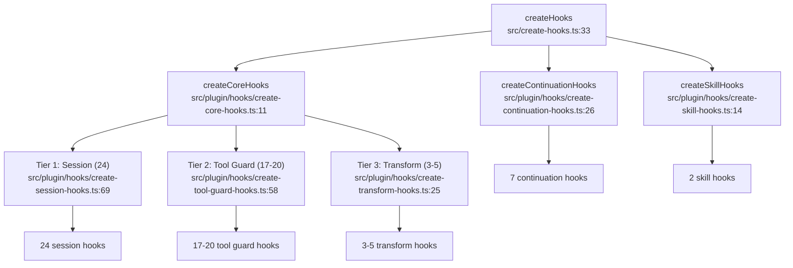

### Tier 1: Session Hooks (24)

| # | Hook Name | File:Line | Event |
|---|-----------|-----------|-------|
| 1 | preemptive-compaction | `hooks/preemptive-compaction.ts:14` | tool.execute.after + event |
| 2 | session-notification | `hooks/session-notification.ts:30` | event |
| 3 | think-mode | `hooks/think-mode/hook.ts:13` | chat.message + event |
| 4 | model-fallback | `plugin/hooks/create-session-hooks.ts:111` | chat.params |
| 5 | anthropic-context-window-limit-recovery | `hooks/anthropic-context-window-limit-recovery/recovery-hook.ts:37` | event |
| 6 | auto-update-checker | `hooks/auto-update-checker/hook.ts:53` | event (session.created) |
| 7 | codegraph-bootstrap | `hooks/codegraph-bootstrap/hook.ts:212` | event (session.created) |
| 8 | ast-grep-sg-provision | `hooks/ast-grep-sg-provision/hook.ts:55` | event (session.created) |
| 9 | agent-usage-reminder | `hooks/agent-usage-reminder/hook.ts:51` | tool.execute.after + event |
| 10 | non-interactive-env | `hooks/non-interactive-env/non-interactive-env-hook.ts:68` | tool.execute.before |
| 11 | interactive-bash-session | `hooks/interactive-bash-session/hook.ts:30` | tool.execute.after + event |
| 12 | ralph-loop | `hooks/ralph-loop/ralph-loop-hook.ts:46` | event (session.idle) |
| 13 | edit-error-recovery | `hooks/edit-error-recovery/hook.ts:39` | tool.execute.after |
| 14 | delegate-task-retry | `hooks/delegate-task-retry/hook.ts:6` | tool.execute.after |
| 15 | start-work | `hooks/start-work/start-work-hook.ts:57` | chat.message + command.execute.before |
| 16 | prometheus-md-only | `hooks/prometheus-md-only/hook.ts:12` | tool.execute.before |
| 17 | sisyphus-junior-notepad | `hooks/sisyphus-junior-notepad/hook.ts:9` | tool.execute.before |
| 18 | question-label-truncator | `hooks/question-label-truncator/hook.ts:50` | tool.execute.before |
| 19 | task-resume-info | `hooks/task-resume-info/hook.ts:5` | tool.execute.after |
| 20 | no-sisyphus-gpt | `hooks/no-sisyphus-gpt/hook.ts:45` | chat.message |
| 21 | no-hephaestus-non-gpt | `hooks/no-hephaestus-non-gpt/hook.ts:37` | chat.message |
| 22 | hephaestus-agents-md-injector | `hooks/hephaestus-agents-md-injector/hook.ts:53` | chat.message + event |
| 23 | runtime-fallback | `hooks/runtime-fallback/hook.ts:29` | event + chat.message |
| 24 | legacy-plugin-toast | `hooks/legacy-plugin-toast/hook.ts:14` | event (session.created) |

### Tier 2: Tool Guard Hooks (17-20)

| # | Hook Name | File:Line | Event |
|---|-----------|-----------|-------|
| 1 | comment-checker | `hooks/comment-checker/hook.ts:36` | tool.execute.before + after + event |
| 2 | tool-output-truncator | `hooks/tool-output-truncator.ts:36` | tool.execute.after |
| 3 | directory-agents-injector | `hooks/directory-agents-injector/hook.ts:38` | tool.execute.after + event |
| 4 | directory-readme-injector | `hooks/directory-readme-injector/hook.ts:33` | tool.execute.after + event |
| 5 | empty-task-response-detector | `hooks/empty-task-response-detector.ts:12` | tool.execute.after |
| 6 | rules-injector | `hooks/rules-injector/hook.ts:38` | tool.execute.before + after + event |
| 7 | tasks-todowrite-disabler | `hooks/tasks-todowrite-disabler/hook.ts:10` | tool.execute.before |
| 8 | write-existing-file-guard | `hooks/write-existing-file-guard/hook.ts:80` | tool.execute.before + event |
| 9 | hashline-read-enhancer | `hooks/hashline-read-enhancer/hook.ts:192` | tool.execute.after |
| 10 | json-error-recovery | `hooks/json-error-recovery/hook.ts:52` | tool.execute.after |
| 11 | read-image-resizer | `hooks/read-image-resizer/hook.ts:115` | tool.execute.after |
| 12 | todo-description-override | `hooks/todo-description-override/hook.ts:3` | tool.definition |
| 13 | webfetch-redirect-guard | `hooks/webfetch-redirect-guard/` | tool.execute.before |
| 14 | fsync-skip-warning | `hooks/fsync-skip-warning/index.ts:20` | tool.execute.before + after |
| 15 | notepad-write-guard | `hooks/notepad-write-guard/index.ts:27` | tool.execute.before |
| 16 | plan-format-validator | `hooks/plan-format-validator/hook.ts:96` | tool.execute.after |
| 17 | confidential-file-guard | `hooks/confidential-file-guard/index.ts:31` | tool.execute.before + after |
| 18 | secret-scanner | `hooks/secret-scanner/index.ts:40` | tool.execute.before |
| 19 | haruspex-guard | `hooks/haruspex-guard/index.ts:21` | tool.execute.before |
| +1 | team-tool-gating | `hooks/team-tool-gating/hook.ts:81` | tool.execute.before (team-mode only) |

### Tier 3: Transform Hooks (3-5)

| # | Hook Name | File:Line | Event |
|---|-----------|-----------|-------|
| 1 | keyword-detector | `hooks/keyword-detector/hook.ts:39` | chat.message |
| 2 | context-injector-messages-transform | `features/context-injector/index.ts` | messages.transform |
| 3 | tool-pair-validator | `hooks/tool-pair-validator/hook.ts:4` | messages.transform |
| +1 | team-mode-status-injector | `hooks/team-mode-status-injector/hook.ts:119` | messages.transform (team only) |
| +2 | team-mailbox-injector | `hooks/team-mailbox-injector/hook.ts:90` | messages.transform (team only) |

### Tier 4: Continuation Hooks (7)

| # | Hook Name | File:Line | Event |
|---|-----------|-----------|-------|
| 1 | stop-continuation-guard | `hooks/stop-continuation-guard/hook.ts:26` | chat.message + event |
| 2 | compaction-context-injector | `hooks/compaction-context-injector/hook.ts:15` | event (session.compacted) |
| 3 | compaction-todo-preserver | `hooks/compaction-todo-preserver/hook.ts:112` | event + tool.execute.before |
| 4 | unstable-agent-babysitter | `hooks/unstable-agent-babysitter/unstable-agent-babysitter-hook.ts:148` | event |
| 5 | background-notification | `hooks/background-notification/hook.ts:38` | chat.message + event |
| 6 | atlas | `hooks/atlas/atlas-hook.ts:7` | event (session.idle) + tool.execute |
| 7 | audit-loop | `hooks/audit-loop/audit-loop-hook.ts:199` | event (session.idle) |

### Tier 5: Skill Hooks (2)

| # | Hook Name | File:Line | Event |
|---|-----------|-----------|-------|
| 1 | category-skill-reminder | `hooks/category-skill-reminder/hook.ts:59` | tool.execute.after + event |
| 2 | auto-slash-command | `hooks/auto-slash-command/hook.ts:75` | chat.message + command.execute.before |

### Team-Mode Event Handlers (+4)

| # | Handler | File:Line |
|---|---------|-----------|
| 1 | team-idle-wake-hint | `hooks/team-session-events/team-idle-wake-hint.ts` |
| 2 | team-lead-orphan-handler | `hooks/team-session-events/team-lead-orphan-handler.ts` |
| 3 | team-member-error-handler | `hooks/team-session-events/team-member-error-handler.ts` |
| 4 | team-member-status-handler | `hooks/team-session-events/team-member-status-handler.ts` |

---

## 4. Hook Event Routing

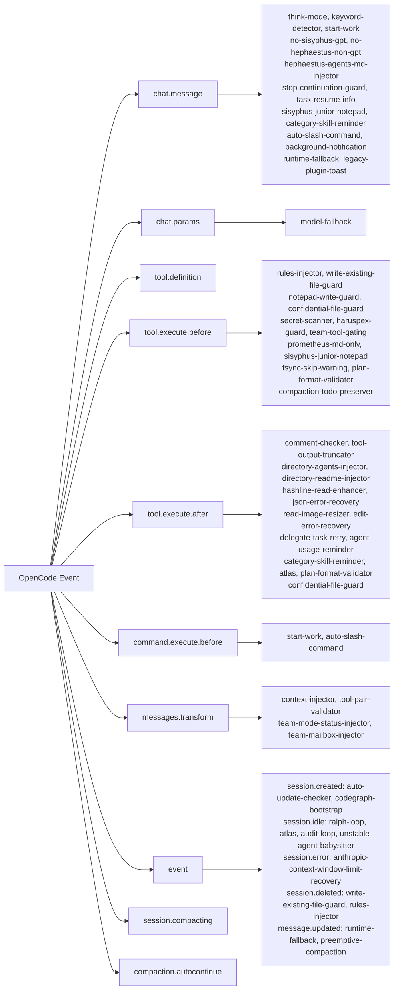

---

## 5. Tool Catalog (31 native + 6 LSP)

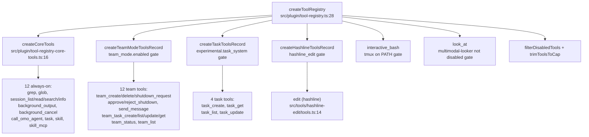

**Always-on tools (12):**
| Tool | File:Line |
|------|-----------|
| grep | `src/tools/grep/tools.ts:8` |
| glob | `src/tools/glob/tools.ts:8` |
| session_list | `src/tools/session-manager/tools.ts:73` |
| session_read | `src/tools/session-manager/tools.ts:102` |
| session_search | `src/tools/session-manager/tools.ts:138` |
| session_info | `src/tools/session-manager/tools.ts:179` |
| background_output | `src/tools/background-task/create-background-output.ts` |
| background_cancel | `src/tools/background-task/create-background-cancel.ts` |
| call_omo_agent | `src/tools/call-omo-agent/tools.ts:111` |
| task | `src/tools/delegate-task/tools.ts:81` |
| skill | `src/tools/skill/tools.ts:28` |
| skill_mcp | `src/tools/skill-mcp/tools.ts:104` |

**LSP tools (via built-in MCP, not native):** lsp_goto_definition, lsp_find_references, lsp_symbols, lsp_diagnostics, lsp_prepare_rename, lsp_rename

---

## 6. Feature Modules (19)

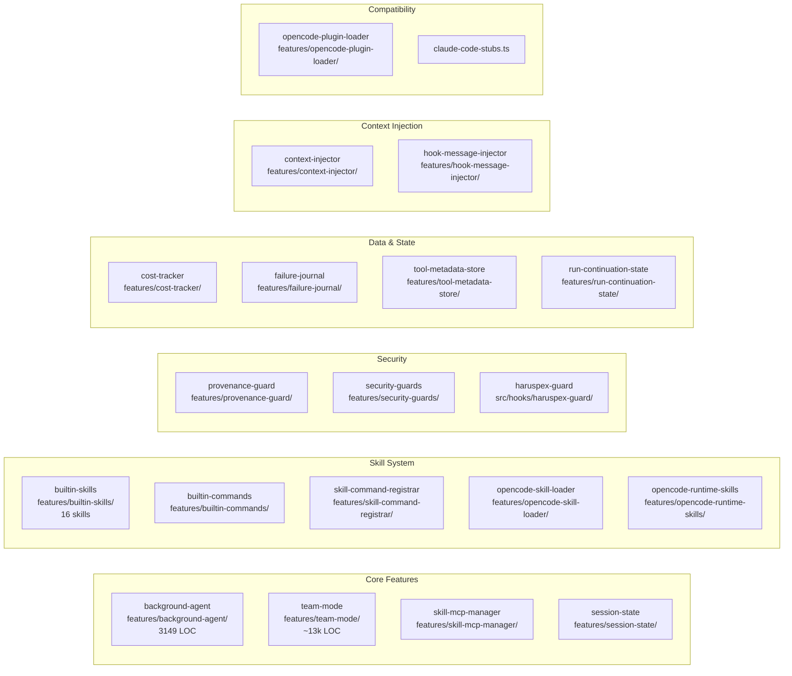

| Feature | File | Purpose |
|---------|------|---------|
| background-agent | `src/features/background-agent/` | Task lifecycle, concurrency, polling |
| team-mode | `src/features/team-mode/` | Parallel multi-agent coordination |
| skill-mcp-manager | `src/features/skill-mcp-manager/` | Tier-3 MCP per-session isolation |
| builtin-skills | `src/features/builtin-skills/` | 16 skills (git-master, playwright, review-work, etc.) |
| builtin-commands | `src/features/builtin-commands/` | Command templates (refactor, init-deep, handoff) |
| context-injector | `src/features/context-injector/` | AGENTS.md/README.md injection |
| cost-tracker | `src/features/cost-tracker/` | Token usage + cost per session/agent |
| failure-journal | `src/features/failure-journal/` | Persistent bug memory for audit loop |
| provenance-guard | `src/features/provenance-guard/` | Source/content/permission verification |
| session-state | `src/features/session-state/` | Subagent session tracking |
| tool-metadata-store | `src/features/tool-metadata-store/` | Tool execution metadata cache |
| skill-command-registrar | `src/features/skill-command-registrar/` | Skill + /command registration |
| run-continuation-state | `src/features/run-continuation-state/` | oh-my-agent run persistence |
| opencode-skill-loader | `src/features/opencode-skill-loader/` | 4-scope skill discovery |
| opencode-runtime-skills | `src/features/opencode-runtime-skills/` | Runtime security skill source |
| hook-message-injector | `src/features/hook-message-injector/` | System message injection helper |
| security-guards | `src/features/security-guards/` | Confidential files + secret scanner |
| opencode-plugin-loader | `src/features/opencode-plugin-loader/` | Plugin component loading |
| claude-code-stubs | `src/features/claude-code-stubs.ts` | Claude Code compat stubs |

---

## 7. Background-Agent Lifecycle

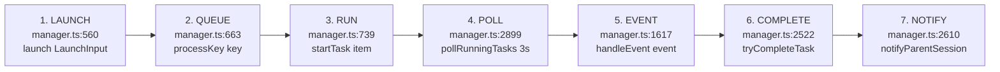

### Detailed Flow

```mermaid
flowchart TD
    LAUNCH["launch LaunchInput"] --> VALIDATE["validate agent, reserve subagent spawn"]
    VALIDATE --> CREATE_TASK["create BackgroundTask status=pending"]
    CREATE_TASK --> START_ATTEMPT["startAttempt task model"]
    START_ATTEMPT --> ENQUEUE["enqueue to queuesByKey concurrency key"]
    ENQUEUE --> TOAST["TaskToastManager.addTask show queued toast"]
    TOAST --> PROCESS["processKey fire-and-forget"]

    PROCESS --> ACQUIRE["ConcurrencyManager.acquire blocks if at limit 5 default"]
    ACQUIRE --> CHECK_CANCEL["check cancellation"]
    CHECK_CANCEL --> START["startTask"]
    START --> SESSION["client.session.create create child session"]
    SESSION --> BIND["bindAttemptSession link attempt to session"]
    BIND --> TOOLS["setSessionTools configure tool permissions"]
    TOOLS --> PROMPT["promptWithRetryInDirectory fire-and-forget"]
    PROMPT --> POLL["startPolling 3s interval"]

    POLL --> STATUS["fetch session statuses"]
    STATUS --> PRUNE["pruneStaleTasksAndNotifications"]
    PRUNE --> STALE["checkAndInterruptStaleTasks"]
    STALE --> CHECK["for each running task:"]
    CHECK --> ACTIVE{"session active?"}
    ACTIVE -->|yes| SKIP["skip event-based progress"]
    ACTIVE -->|terminal| COMPLETE["tryCompleteTask"]
    ACTIVE -->|idle/gone| VALIDATE2["validateSessionHasOutput"]
    VALIDATE2 --> TODOS["checkSessionTodos"]
    TODOS --> COMPLETE

    COMPLETE --> RESERVE["reserveNotificationPreparation"]
    RESERVE --> FINALIZE["finalizeAttempt completed"]
    FINALIZE --> RECORD["record to TaskHistory"]
    RECORD --> RELEASE["ConcurrencyManager.release"]
    RELEASE --> ABORT["abortWithTimeout session"]
    ABORT --> NOTIFY["enqueueNotificationForParent"]
    NOTIFY --> TOAST2["TaskToastManager.showCompletionToast"]
```

**Key timeouts:**
| Constant | Value | Purpose |
|----------|-------|---------|
| POLLING_INTERVAL_MS | 3,000ms | Poll frequency |
| MIN_IDLE_TIME_MS | 5,000ms | Min runtime before idle completion |
| MIN_STABILITY_TIME_MS | 10,000ms | Message count must be stable for 10s |
| TASK_TTL_MS | 30 min | Max lifetime for any task |
| DEFAULT_STALE_TIMEOUT_MS | 45 min | Stale task interruption |
| DEFAULT_MESSAGE_STALENESS_TIMEOUT_MS | 60 min | No-activity-since-start |
| TASK_CLEANUP_DELAY_MS | 10 min | Delay before removing from memory |

**Completion detection:** Both signals must agree:
1. Session idle event (session.idle or session.status idle)
2. Stability detection (message count unchanged for 10s)

---

## 8. Audit-Loop

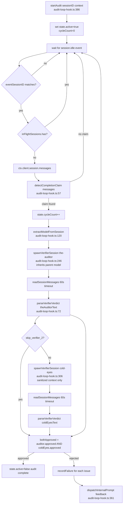

**Verifier context:**
- The-Auditor: full context (original task + agent claims + changed files + plan)
- Cold-Eyes: sanitized context (original task + changed files ONLY, no agent self-report)

---

## 9. Config System

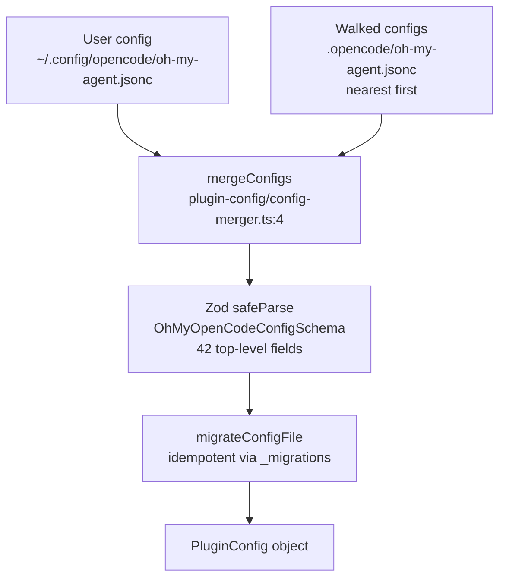

**Merge strategy:**
| Field Category | Strategy |
|----------------|----------|
| agents, categories, team_mode, claude_code | deepMerge (recursive) |
| disabled_* arrays | Set union (concatenate + dedup) |
| mcp_env_allowlist | User-only (security) |
| All other fields | Override replaces base |

**Config walk order:**
1. Start with defaults (Zod safeParse fills omitted fields)
2. Merge user config layers (nearest first)
3. Merge ancestor configs (farthest first, so nearest ancestor wins last)

**48 schema files in `src/config/schema/`:**
| Schema | File | Purpose |
|--------|------|---------|
| Root | `oh-my-opencode-config.ts:41` | 42 top-level fields |
| Agent names | `agent-names.ts:3` | 15 builtin agents |
| Model tier | `model-tier.ts:3` | cheap/medium/expensive |
| Audit loop | `audit-loop.ts:3` | enabled, max_cycles, skip_verifier_2 |
| Team mode | `team-mode.ts` | Re-exports from team-core |
| Categories | `categories.ts:4` | 8 built-in categories |
| Hooks | `hooks.ts:3` | 56 hook names enum |
| Experimental | `experimental.ts` | Feature flags |

---

## 10. MCP System (3 tiers)

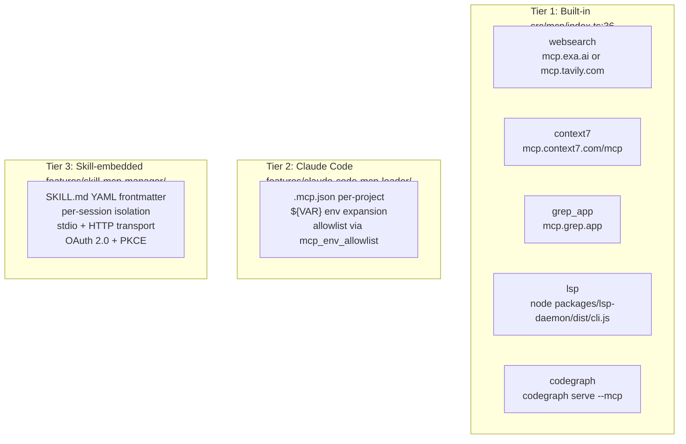

**Tier 3 lifecycle:**
1. session.created -> No action (lazy)
2. First MCP tool call -> getOrCreateClient creates + caches
3. Ongoing use -> lastUsedAt updated
4. Idle >5min -> cleanup timer removes
5. session.deleted -> disconnectSession closes clients
6. Process exit -> disconnectAll via SIGINT/SIGTERM

**Client key:** `${sessionID}:${skillName}:${serverName}` (per-session isolation)

---

## 11. Model Resolution

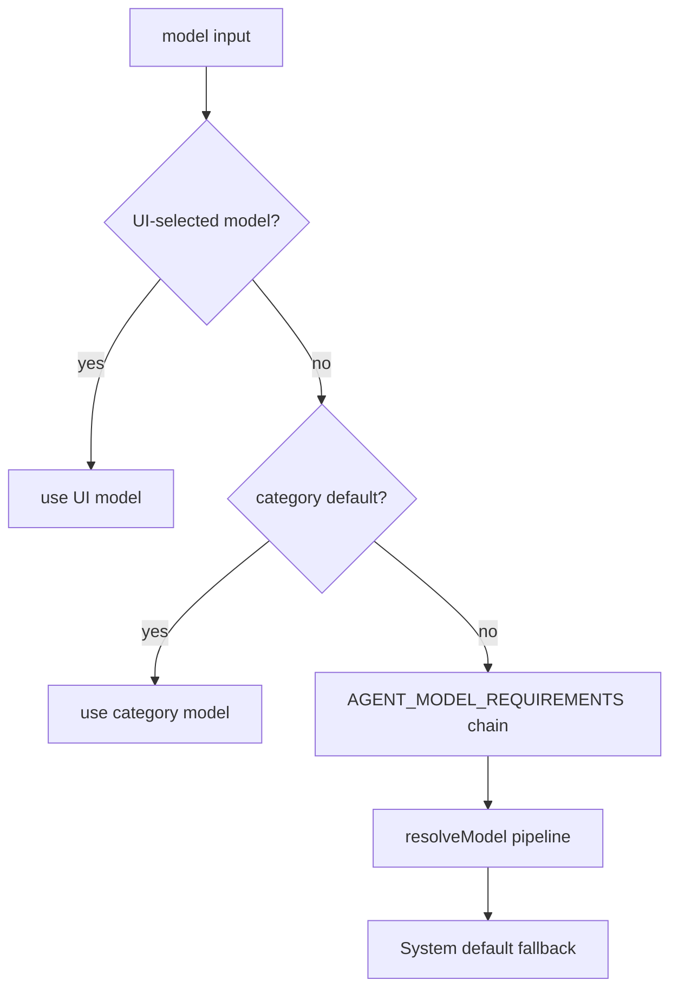

**Model tier config (src/config/schema/model-tier.ts:3):**
- `cheap`: explore, librarian, sisyphus-junior
- `medium`: momus, metis, cold-eyes
- `expensive`: sisyphus, hephaestus, the-auditor, ml-ai-engineer

**Two fallback systems:**
- `model-fallback` (proactive, chat.params, hardcoded chains)
- `runtime-fallback` (reactive, session.error, configurable per-category/agent)

---

## 12. File Reference Tables

### Entry & Init
| File | Line | Role |
|------|------|------|
| `src/index.ts` | 6 | Plugin entry, exports server |
| `src/testing/create-plugin-module.ts` | 97 | createPluginModule, staged init |
| `src/plugin-interface.ts` | 20 | 14 OpenCode hook handlers |
| `src/create-managers.ts` | 42 | Manager instantiation |
| `src/create-tools.ts` | 23 | Tool registry assembly |
| `src/create-hooks.ts` | 33 | 5-tier hook composition |

### Agents (15)
| Agent | File | Line | Mode |
|-------|------|------|------|
| Sisyphus | `src/agents/sisyphus-agent-factory.ts` | 67 | primary |
| Hephaestus | `src/agents/hephaestus/agent.ts` | 131 | primary |
| Prometheus | `src/agents/prometheus/system-prompt.ts` | -- | primary |
| Atlas | `src/agents/atlas/agent.ts` | 119 | primary |
| Oracle | `src/agents/oracle.ts` | 411 | subagent |
| Librarian | `src/agents/librarian.ts` | 24 | subagent |
| Explore | `src/agents/explore.ts` | 27 | subagent |
| Multimodal-Looker | `src/agents/multimodal-looker.ts` | 14 | subagent |
| Metis | `src/agents/metis.ts` | 398 | subagent |
| Momus | `src/agents/momus.ts` | 281 | subagent |
| Sisyphus-Junior | `src/agents/sisyphus-junior/agent.ts` | 100 | subagent |
| The Auditor | `src/agents/the-auditor.ts` | 88 | all |
| Cold Eyes | `src/agents/cold-eyes.ts` | 89 | subagent |
| ML/AI Engineer | `src/agents/ml-ai-engineer.ts` | 81 | all |
| Haruspex | `src/agents/haruspex.ts` | 102 | subagent |

### Hook Tiers
| Tier | Count | Composer File |
|------|-------|---------------|
| Session | 24 | `src/plugin/hooks/create-session-hooks.ts:69` |
| Tool Guard | 17-20 | `src/plugin/hooks/create-tool-guard-hooks.ts:58` |
| Transform | 3-5 | `src/plugin/hooks/create-transform-hooks.ts:25` |
| Continuation | 7 | `src/plugin/hooks/create-continuation-hooks.ts:26` |
| Skill | 2 | `src/plugin/hooks/create-skill-hooks.ts:14` |
| Team Events | +4 | `src/plugin/event.ts` |

### Features
| Feature | Directory |
|---------|-----------|
| background-agent | `src/features/background-agent/` |
| team-mode | `src/features/team-mode/` |
| skill-mcp-manager | `src/features/skill-mcp-manager/` |
| builtin-skills | `src/features/builtin-skills/` |
| builtin-commands | `src/features/builtin-commands/` |
| context-injector | `src/features/context-injector/` |
| cost-tracker | `src/features/cost-tracker/` |
| failure-journal | `src/features/failure-journal/` |
| provenance-guard | `src/features/provenance-guard/` |
| session-state | `src/features/session-state/` |
| tool-metadata-store | `src/features/tool-metadata-store/` |
| skill-command-registrar | `src/features/skill-command-registrar/` |
| run-continuation-state | `src/features/run-continuation-state/` |
| opencode-skill-loader | `src/features/opencode-skill-loader/` |
| opencode-runtime-skills | `src/features/opencode-runtime-skills/` |
| hook-message-injector | `src/features/hook-message-injector/` |
| security-guards | `src/features/security-guards/` |
| opencode-plugin-loader | `src/features/opencode-plugin-loader/` |
| claude-code-stubs | `src/features/claude-code-stubs.ts` |

### Shared Utilities (most imported)
| Utility | File | Import Count |
|---------|------|-------------|
| logger | `src/shared/logger.ts` | 62 |
| data-path | `src/shared/data-path.ts` | 11 |
| model-requirements | `src/shared/model-requirements.ts` | 11 |
| system-directive | `src/shared/system-directive.ts` | 11 |
| frontmatter | `src/shared/frontmatter.ts` | 10 |

### Config Schema Files
| Schema | File |
|--------|------|
| Root | `src/config/schema/oh-my-opencode-config.ts:41` |
| Agent names | `src/config/schema/agent-names.ts:3` |
| Model tier | `src/config/schema/model-tier.ts:3` |
| Audit loop | `src/config/schema/audit-loop.ts:3` |
| Categories | `src/config/schema/categories.ts:4` |
| Hooks | `src/config/schema/hooks.ts:3` |
| Experimental | `src/config/schema/experimental.ts` |
| Background task | `src/config/schema/background-task.ts` |
| Team mode | `src/config/schema/team-mode.ts` |
| Skills | `src/config/schema/skills.ts` |
